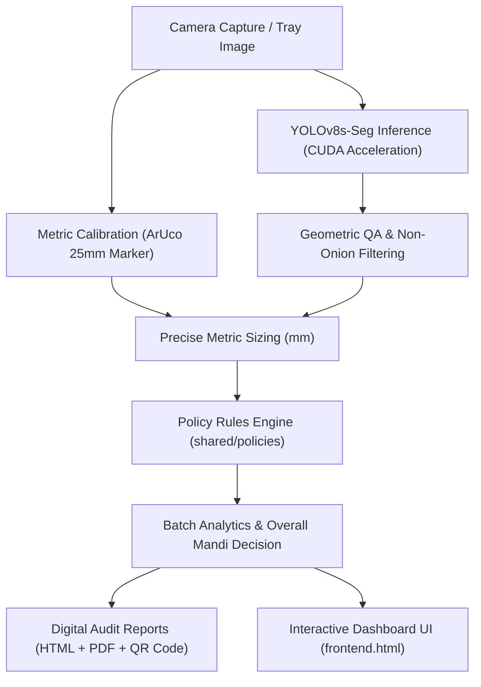

# 🧅 OnionAI: Automated Onion Quality Grading & Traceability System

[](https://python.org)
[](https://pytorch.org)
[](https://github.com/ultralytics/ultralytics)
[](https://palletsprojects.com/p/flask/)
[](https://opencv.org)
[](https://sih.gov.in)

An AI-powered computer vision and metrology system developed for **Smart India Hackathon (SIH)** to automate onion procurement inspection at agricultural market committees (APMC Mandis). 

Combines **YOLOv8 instance segmentation**, **ArUco optical metric calibration**, and **configurable government policy rule engines** to classify onions into standard commercial grades with 100% digital auditability.

---

## 🌟 Key Features

- **Deep Learning Instance Segmentation**: Trained on **YOLOv8s-seg** to simultaneously localize, segment polygon masks, and classify onion surface defects (`Grade A`, `Grade URS`, `Reject`).
- **Precision Metrology (ArUco Calibration)**: Utilizes a standard 25 mm physical reference marker (`DICT_4X4_50`) to compute sub-millimeter scale factors (`pixels_per_mm`), allowing exact physical diameter estimation ($D = 2 \times \sqrt{\text{Area}/\pi} / \text{ppm}$).
- **Government Procurement Policy Engine**: Evaluates configurable mandi quality rules:
  - **`GRADE_A`**: Meets strict diameter limits (45–65 mm) with zero surface defects.
  - **`GRADE_URS`** (Under-Ripe / Slight Defects): Meets commercial size limits (35–70 mm) with minor defects tolerated.
  - **`REJECTED`**: Visible rot, severe damage, mold, or out-of-market size bounds.
  - **`MANUAL_REVIEW`**: Auto-routed when scale markers are missing or AI confidence is low.
- **Enterprise Interactive Dashboard**: Modern web interface supporting:
  - 1-Click test presets for instant validation
  - Live webcam capture & drag-and-drop uploads
  - Real-time batch KPI metrics (Grade A %, URS %, Reject %, Avg Diameter)
  - Visual mask overlay vs raw capture toggle
  - Per-onion quality ledger with specific policy reason codes
- **Digital Audit & Traceability Certificates**: Generates verifiable HTML inspection summaries and certified PDF documents with scannable **QR codes** for farmer-mandi dispute resolution.

---

## 🏗 System Architecture



---

## 📊 Model Evaluation Results

Trained on NVIDIA RTX GPU using 50 epochs on the SIH segmented onion dataset:

| Metric | Score |
| :--- | :--- |
| **Box mAP@50** | **93.6%** |
| **Box mAP@50-95** | **83.9%** |
| **Mask mAP@50** | **91.3%** |
| **Precision (B)** | **85.1%** |
| **Recall (B)** | **85.8%** |

*Trained weights are included in `model_backend/best.pt` (23.8 MB).*

---

## 📁 Repository Structure

```
├── model_backend/              # Model Serving & Web UI
│   ├── api.py                  # Unified REST API service
│   ├── frontend.html           # High-end interactive inspection UI
│   ├── inference.py            # Standalone CLI inference tool
│   ├── best.pt                 # Trained YOLOv8s-seg weights (93.6% mAP50)
│   └── onion.yaml              # Class configuration
│
├── ml_backend/                 # End-to-End Business Logic
│   ├── pipeline.py             # Orchestrates calibration -> detection -> grading
│   ├── report.py               # Generates HTML/PDF audit certificates + QR codes
│   ├── vision/                 
│   │   ├── detect.py           # YOLO inference, non-onion filtering, mask rendering
│   │   ├── calibrate.py        # ArUco marker detection & pixels-per-mm calibration
│   │   └── grade.py            # Sizing math & policy rule engine
│   └── policies/               # Policy loaders
│
├── shared/
│   ├── policies/               # Active mandi grading thresholds (default_policy.json)
│   └── types.py                # Dataclasses & schema models
│
├── scripts/
│   ├── demo.py                 # Multi-mode CLI demonstration
│   ├── generate_synthetic_data.py # Calibrated tray generation utility
│   ├── prepare_dataset.py      # COCO to YOLO segmentation dataset converter
│   └── train_model.py          # YOLOv8s-seg training pipeline
│
├── data/
│   ├── real/images/valid/      # Validation dataset images for instant testing
│   └── synthetic/              # Calibrated multi-onion procurement trays
│
└── requirements.txt            # System dependencies
```

---

## 🚀 Quickstart Guide

### 1. Clone & Set Up Environment

```bash
git clone https://github.com/arjitujjawal-art/onion-grading.git
cd onion-grading

# Create virtual environment
python -m venv venv
source venv/bin/activate  # On Windows: .\venv\Scripts\activate

# Install dependencies
pip install -r requirements.txt
```

### 2. Launch the Interactive Dashboard

```bash
python model_backend/api.py
```
Open your browser to: **`http://localhost:5000`**

- Click any of the **Instant Presets** (`Grade A Prime`, `Grade URS`, `Reject Onion`, `Calibrated Tray`).
- Upload your own images or click **Webcam** to test with a camera.
- View real-time diameter estimations, batch grade statistics, and download certified PDF reports.

### 3. Run the Command-Line Demo

```bash
# Test on 3 real validation images from the dataset
python scripts/demo.py --mode real --count 3

# Test on the calibrated procurement tray with 25mm ArUco marker
python scripts/demo.py --mode tray

# Grade any custom image
python model_backend/inference.py --source <image_path> --pipeline
```

---

## 📡 REST API Reference

| Method | Endpoint | Description |
| :--- | :--- | :--- |
| `GET` | `/` | Serves the interactive inspection UI dashboard |
| `GET` | `/health` | Returns GPU telemetry, model accuracy, and active policy |
| `POST` | `/predict` | Full grading pipeline on uploaded image (multipart or base64) |
| `GET` | `/sample-images` | Returns curated validation samples for testing |
| `GET` | `/policy` | Retrieves current mandi grading policy thresholds |
| `POST` | `/policy` | Dynamically updates diameter limits and calibration rules |
| `GET` | `/reports/<id>/pdf` | Downloads certified audit PDF with QR code |
| `GET` | `/reports/<id>/html`| Views digital inspection certificate in browser |

---

## 📜 Grading Standards

Default specifications per [`shared/policies/default_policy.json`](shared/policies/default_policy.json):

| Grade | Allowed Diameter | Defect Tolerances | Action |
| :--- | :--- | :--- | :--- |
| **Grade A** | 45 mm – 65 mm | Zero rot, zero damage, zero sprouting | Full Mandi MSP Payout |
| **Grade URS** | 35 mm – 70 mm | Slight skin peeling, minor shape defects | Discounted Commercial Tier |
| **Reject** | $<35$ mm or $>70$ mm | Visible rot, severe cuts, or heavy sprouting | Rejected / Returned |
| **Manual Review** | Any | Missing calibration or low AI confidence ($<40\%$) | Flagged for Human Officer |

---

## 👥 Contributors

- **Smart India Hackathon (SIH)** Team
- **Arjit Ujjawal** ([@arjitujjawal-art](https://github.com/arjitujjawal-art))

## 📄 License
This project is licensed under the MIT License.
